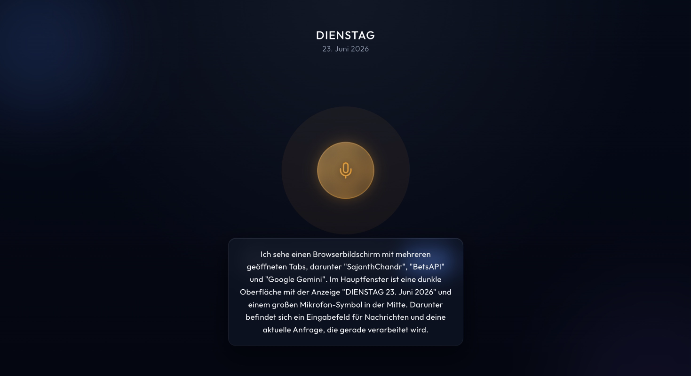

# Gassi-Jarvis

> A self-hosted, voice-controlled AI assistant for macOS that turns your phone into a remote brain for your laptop. Speaks back, sees the screen, runs commands — gated by a Human-in-the-Loop security layer.

> **Live demo:** none — this project controls a personal Mac, so there's no shared instance to try. Screenshot below; clone and run it locally to try it yourself.



*Above: the PWA after asking Jarvis to look at the screen. Vision tool fires `screencapture`, Gemini Vision returns a German description, Edge-TTS speaks it back.*

---

## Motivation

I take my dog for a 45-minute walk every day. That's three hours a week of unstructured time where I have a phone in my pocket and a laptop sitting unused at home. I wanted a way to keep working through that time — to think out loud, pull up notes, kick off scripts, check on running processes — without staring at a small screen. Existing voice assistants are a chat box; I wanted an *agent* with a real keyboard behind it. So I built one.

Gassi-Jarvis is the result: a Large Action Model that lives on my Mac, exposes itself to my phone over a private tunnel, and uses the LLM as both conversationalist and command translator.

---

## What It Does

- **Talks back.** Voice input from the browser; Edge-TTS for natural-sounding voice output (German default, configurable).
- **Holds context.** Multi-turn conversations with in-memory session state and a persistent ChromaDB vector store for long-term memory.
- **Sees the screen.** Takes silent macOS screenshots and feeds them to Gemini Vision for visual Q&A.
- **Knows what's current.** Google Search grounding for live facts — weather, news, prices — while still answering static questions from the model directly.
- **Runs commands — safely.** A layered security router classifies every shell command. Dangerous commands route through a Human-in-the-Loop voice approval flow before executing.
- **Reaches your phone.** FastAPI backend behind ngrok/Tailscale + bearer-token auth, so the assistant follows you anywhere.

---

## Scope & Security Model

Gassi-Jarvis is a **single-user, self-hosted** assistant. The backend runs on the user's own machine and controls only that machine — no remote-viewing capability, no third-party telemetry, and no cloud component beyond the explicit LLM call to Google Gemini.

Security is layered, with each layer designed to fail closed:

- **Authentication & transport** — bearer-token auth, rate limiting, and CORS scoping for any non-localhost traffic.
- **Command classification** — every shell command the LLM proposes is parsed and risk-rated before it can run.
- **Human-in-the-Loop** — anything not classified as clearly safe requires explicit voice approval in the next turn.
- **Secret hygiene** — credentials and the long-term memory store live outside the repo and are excluded from container builds.

Concrete configuration lives in [`security.py`](app/security.py); the design rationale is in [architecture.md](architecture.md).

---

## Architecture

```
phone PWA  ──(ngrok / Tailscale, HTTPS)──>  FastAPI gateway (main.py)
                                                  |
            ┌─────────────────────────┬───────────┴────────────┐
            v                         v                        v
       agent.py                  memory.py                security.py / vision.py
       (Gemini LLM,              (Sessions +              (Sandboxed shell exec
        tool decls,               ChromaDB RAG)            + macOS screen capture)
        intent classifier)
                                                                |
                                                                v
                                                          macOS shell
```

| Module | Responsibility |
|---|---|
| [`main.py`](app/main.py) | FastAPI gateway, auth, CORS, rate limit, HitL interceptor, tool dispatch |
| [`models.py`](app/models.py) | Pydantic v2 request/response contracts |
| [`agent.py`](app/agent.py) | Google Gemini integration, tool declarations, intent classifier |
| [`memory.py`](app/memory.py) | Session state + ChromaDB long-term memory |
| [`security.py`](app/security.py) | Command threat classification + sandboxed execution |
| [`vision.py`](app/vision.py) | Silent screenshot capture + JPEG compression |
| [`logging_config.py`](app/logging_config.py) | Centralized logging with `JARVIS_LOG_LEVEL` env toggle |

---

## Tech Stack

- **Backend:** Python 3.13, FastAPI, Uvicorn, Pydantic v2
- **LLM:** Google Gemini 2.5 Flash via `google-genai` SDK
- **Voice:** Microsoft Edge-TTS (German)
- **Memory:** ChromaDB (persistent vector store)
- **Frontend:** Installable PWA (web manifest + service worker), vanilla HTML/JS, no framework
- **Security:** SlowAPI rate limiting, FastAPI CORS, bearer-token auth
- **Remote access:** ngrok or Tailscale
- **Target platform:** macOS (Apple Silicon)

---

## Setup

### 1. Prerequisites

```bash
brew install python@3.13
```

### 2. Install

```bash
git clone https://github.com/<your-username>/gassi-jarvis.git
cd gassi-jarvis

python3.13 -m venv venv
source venv/bin/activate

pip install --upgrade pip
pip install -r requirements.txt
```

### 3. Configure

Create a `.env` in the project root:

```ini
# LLM
GOOGLE_API_KEY=your_gemini_key

# Required for any non-localhost access.
# Generate with: python -c "import secrets; print(secrets.token_urlsafe(32))"
JARVIS_API_TOKEN=your_long_random_secret

# CORS origins (comma-separated). Defaults to localhost.
JARVIS_ALLOWED_ORIGINS=https://your-tunnel.ngrok-free.dev

# Optional
JARVIS_LOG_LEVEL=INFO            # DEBUG | INFO | WARNING | ERROR
JARVIS_SHELL_CWD=/path/to/sandbox
JARVIS_BRAIN_DIR=/path/to/chromadb
```

### 4. Run

```bash
uvicorn app.main:app --host 127.0.0.1 --port 8000
```

Open `http://localhost:8000` for the PWA, or `http://localhost:8000/docs` for the Swagger UI.

### 5. Reach it from your phone

Either:

- **ngrok** — quick:
  ```bash
  ngrok http 8000
  ```
  Visit the printed `https://*.ngrok-free.dev` URL on your phone; the PWA prompts for the token once and caches it for 12 hours.

- **Tailscale** — safer:
  Install Tailscale on Mac + phone with the same account. Point your phone at `http://<mac-tailscale-ip>:8000`. The Mac never opens a port to the public internet.

---

## Tests

```bash
pip install -r requirements-dev.txt
python -m pytest tests/ -v
```

The suite covers the security router: threat classification, shell-metachar detection, sensitive-path read blocking, `find` argument inspection, and the execution gate.

---

## API Contract

`POST /api/chat`

Headers:
```
Authorization: Bearer <JARVIS_API_TOKEN>
Content-Type: application/json
```

Request:
```json
{
  "session_id": "voice_walk_01",
  "timestamp": "2026-05-22T20:00:00Z",
  "payload": {
    "type": "text",
    "content": "Jarvis, mach mal einen Screenshot und schau dir den Code an."
  }
}
```

Response:
```json
{
  "status": "success",
  "jarvis_response": "Habe ich. Der Fehler liegt in Zeile 42 …",
  "audio_base64": "UklGRig…",
  "action_taken": "vision_screenshot_analyzed"
}
```

---

## Roadmap

- [x] FastAPI gateway with strict Pydantic validation
- [x] Gemini integration with in-memory multi-turn sessions
- [x] Edge-TTS voice output, browser STT input
- [x] Persistent long-term memory via ChromaDB RAG
- [x] Layered HitL security router for macOS execution
- [x] Multimodal vision (screenshots + Gemini Vision)
- [x] Bearer-token auth, rate limit, CORS, structured logging
- [x] Frontend Kill-Switch via AbortController for instant audio interrupts
- [x] Token TTL (12h) on the PWA
- [x] Conversation transcript UI with inline Human-in-the-Loop approval cards
- [x] Installable PWA (web manifest, maskable icons, service worker)
- [x] Live web knowledge via Google Search grounding (read-only)
- [ ] Local wake-word detection (Porcupine / Picovoice)
- [ ] WebSocket audio streaming for sub-second turn-taking
- [ ] HitL gate on any tool call originating from screenshot or recalled-memory content (defense against indirect prompt injection)

---

## Disclaimer

This is a personal research project and not a production-hardened product. It executes shell commands on the host machine driven by an LLM; misconfiguration (weak token, exposed port, missing CORS) could be exploited. Use it on your own machine, with a strong token, behind a tunnel — and read [`security.py`](app/security.py) before you trust it with anything.

---

## License

[MIT](LICENSE) © 2026 Sajanth Chandrakumar
