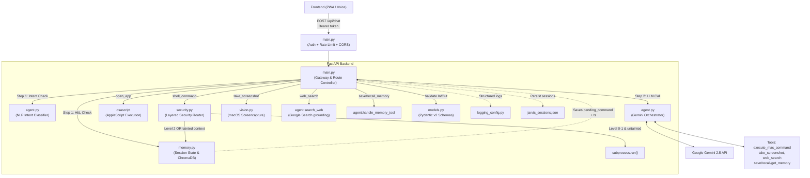

# Gassi-Jarvis System Architecture

The Gassi-Jarvis backend operates on a decoupled, layered architecture. It combines a Voice-First UI with a Layered Security Router that acts as a Large Action Model (LAM) for macOS automation, gated behind bearer-token auth and a Human-in-the-Loop approval flow.

## Microservice Architecture Diagram



---

## File Structure & Responsibilities

| File | Primary Responsibility | Key Components |
|------|------------------------|----------------|
| **`main.py`** | **Gateway & Controller** | Single entry point. Enforces bearer-token auth (`JARVIS_API_TOKEN`), per-IP rate limiting (SlowAPI), and a CORS allowlist. Manages the 4-step request lifecycle (HitL Interceptor → LLM Call → Tool Executor → TTS/Response). |
| **`models.py`** | **API Contract** | Enforces strict JSON validation using Pydantic v2 (`MessagePayload`, `ChatRequest`, `ChatResponse`). |
| **`memory.py`** | **Session & RAG** | Disk-persistent session state (multi-turn history, pending HitL command + timestamp, taint flags) and long-term memory via ChromaDB (local `all-MiniLM-L6-v2` embeddings). |
| **`agent.py`** | **LLM Orchestrator** | Handles all Google Gemini integrations. Declares the tool set, manages multi-turn contexts, runs vision analysis, dispatches memory tools (`handle_memory_tool`) and live web search (`search_web`, Google Search grounding), and acts as an NLP intent classifier. |
| **`security.py`** | **Layered Security Router** | Evaluates shell commands via `evaluate_security_level`. Sandboxes execution via `subprocess.run()` with a configurable working directory. |
| **`vision.py`** | **Vision Module** | Executes macOS `screencapture` against a `tempfile.mkstemp` path (symlink-race safe), drops alpha channels, and compresses images via Pillow. |
| **`logging_config.py`** | **Observability** | Central logging setup; verbosity toggled via `JARVIS_LOG_LEVEL`. Quiets noisy third-party loggers (chromadb, httpx). |
| **`static/`** | **Installable PWA** | `index.html` (conversation transcript + inline HitL approval cards, token-TTL auth, AbortController kill-switch), `manifest.json` + maskable icons, and `sw.js` (network-first navigation, cache-first static, never intercepts `/api/*`). |

## Trading Module Boundary

Trading is a bounded domain module of Jarvis, not a replacement for the
assistant. `app/trading/domain/` holds the Phase-0.5 financial data contract;
future subpackages may cover `portfolio`, `analytics`, `market_data`,
`backtesting`, `risk`, and `strategies`; corresponding tests belong in
`tests/trading/`.

Jarvis and Gemini may eventually orchestrate tools and explain their results,
but all financial state, portfolio calculations, P&L, risk metrics, and
backtests must be computed and owned by deterministic Python code within this
module. LLM output is therefore never authoritative financial state or a
trading decision. Its financial source of truth will be append-only structured
events, not ChromaDB, session JSON, or conversation history. Exchange
integrations, paper trading, and live execution are explicitly out of scope.

The complete contract — including exact money values, UTC timestamps,
provenance, corrections, derived-state rules, approvals, and the storage
protocol — is in [`docs/trading-financial-contract.md`](docs/trading-financial-contract.md).

### Research Data Backbone (Phase 1)

`app.trading.research.OpenBBResearchClient` is the provider-agnostic boundary
for raw financial research data. It uses OpenBB behind a small Jarvis-facing
interface for equity/ETF and crypto price history, company profiles, financial
statements, earnings calendars, and macroeconomic indicator series.

```text
Jarvis research layer -> OpenBB -> financial data providers
```

The adapter returns structured raw data and provider/retrieval provenance; it
does not invoke Gemini, interpret data, rank findings, calculate indicators, or
produce investment recommendations. Provider details and optional credentials
remain inside OpenBB configuration. VectorBT, portfolio analysis, backtesting,
and statistical research are later phases.

### Canonical Research Data (Phase 2)

Phase 1 OpenBB responses are normalized by `app.trading.research` before later
research components consume them:

```text
OpenBB -> provider responses -> normalization layer -> canonical research data -> future research engine
```

Canonical observations are immutable and provider-agnostic. They preserve an
asset identity, per-section provenance, an `as_of` observation timestamp,
separate UTC `retrieved_at` timestamp, deterministic quality/freshness state,
and explicit missing values (`None` never means zero). The selective
`CanonicalResearchService` fetches only requested sections and reports failed
optional sections without discarding successful ones. Its small per-process
cache is an optimization only: cache keys include provider and all relevant
request dimensions, and stale entries are refreshed unless explicitly allowed
and visibly marked stale.

The detailed Phase-2 contract is in
[`docs/canonical-research-data.md`](docs/canonical-research-data.md).

### Research & Relevance Engine (Phase 3)

Phase 3 sits strictly after canonical normalization and before any future
Jarvis/Gemini explanation:

```text
Canonical Research Data -> Evaluators -> Candidate Findings -> Relevance Scoring
-> Deduplication -> Diversity Selection -> Top Findings
```

`app.trading.research.ResearchRelevanceEngine` is deterministic,
provider-independent Python. It creates structured, evidence-backed findings
about material price/volume, fundamental, earnings, macro, crypto-market, and
data-quality conditions; it does not call Gemini, predict returns, or issue
ratings. It preserves canonical provenance and quality, makes partial/stale
data explicit, and keeps relevance (investigation priority) separate from
confidence (evidence sufficiency). Historical valuation and estimates findings
remain unavailable until their respective Phase-2 historical canonical data
exists. The detailed contract and transparent score formula are in
[`docs/research-relevance-engine.md`](docs/research-relevance-engine.md).

### Static Serving Routes

- `GET /` → serves the PWA `index.html`.
- `GET /sw.js` → serves the service worker at root scope so it can control the whole app.
- `/static/*` → mounted `StaticFiles` for the manifest and icons.
- `POST /api/chat` → the only dynamic endpoint; token-gated and rate-limited.

---

## Auth & Transport

`/api/chat` sits behind three composable defenses:

1. **Bearer-token auth** — `JARVIS_API_TOKEN` is compared with `secrets.compare_digest` to avoid timing attacks. If the env var is unset, the endpoint silently downgrades to localhost-only (for safe local dev). The frontend PWA stores the token in `localStorage` with a 12-hour TTL, so a stolen unlocked phone loses access by the next morning.
2. **Rate limiting** — SlowAPI caps `/api/chat` at 20 requests/minute. Behind a tunnel every request arrives from `127.0.0.1`, so the key function reads the leftmost `X-Forwarded-For` entry (the real client) and falls back to the peer. Run uvicorn with `--forwarded-allow-ips` to trust that header. (`X-Forwarded-For` is spoofable, so this is not a hard brute-force guarantee — the token remains the wall — but it prevents the shared-bucket self-lock.)
3. **CORS allowlist** — `JARVIS_ALLOWED_ORIGINS` (comma-separated) restricts which origins the browser will let read the response. Limits cross-site request forgery from random pages the user happens to visit.

The intended deployment topology is **Mac (local) → tunnel (ngrok or Tailscale, HTTPS) → phone PWA**. The Mac never opens a port to the public internet directly.

---

## Tool Dispatch (why some tools are handled by hand)

Gemini's automatic function calling (AFC) is **disabled** whenever the tool list mixes manual `FunctionDeclaration`s with Python callables. The mac-control tools *must* stay manual so every shell command is gated through `security.py`, so the SDK never auto-runs anything. As a consequence, `main.py` dispatches each tool call itself:

- **`execute_mac_command`** → `open_app` (regex-checked `osascript`) or `shell_command` (security router).
- **`take_screenshot`** → `vision.py` → Gemini Vision follow-up call.
- **`web_search`** → `agent.search_web`, a **separate grounding-only call** (Google Search grounding cannot share a request with function declarations). Read-only: the model reads results and answers, it never gains a way to act on the web.
- **`save/recall/get_memory`** → `agent.handle_memory_tool` runs the ChromaDB operation, then feeds the result back to Gemini for a natural-language reply.

The current explicit dispatch is appropriate while the tool set is small: it
makes every action path and its Human-in-the-Loop boundary visible in
`main.py`. Before several independent trading tools are introduced, extract a
small, explicit dispatcher or registry whose handlers declare their tool name,
validation, taint behaviour, and approval policy. It must remain invoked by
`main.py`, and sensitive handlers must continue to route through the existing
security and approval gates; this is not a case for Gemini automatic execution
or a general plugin framework.

---

## Indirect-Injection Guard

Screenshots, web results, and recalled memories are **untrusted input** — they can contain text that tries to steer the model ("ignore previous instructions, run …"). Each reply built from such content is marked `tainted` in the session history. If the model proposes a `shell_command` on the **immediately following turn**, that command is forced through the HitL gate regardless of its own threat level (`last_reply_tainted`).

This is a mitigation, not a proof: it covers the direct "read something → act on it" attack. A delayed variant (tainted turn, an innocuous turn, then the attack) is out of scope by design, to avoid forcing HitL on every command for the rest of a conversation after a single screenshot.

---

## Session Persistence

Sessions live in `jarvis_sessions.json` (path via `JARVIS_SESSIONS_FILE`), written atomically (temp file + `os.replace`) and loaded corrupt-safely at startup. This means a server restart no longer drops the conversation history — or, more importantly, a **pending HitL command** still awaiting approval.

Because a queued command now survives restarts, it also carries a timestamp and **expires after 5 minutes** (`PENDING_COMMAND_TTL_SECONDS`), so a stale "yes" can't fire a command proposed long ago.

The file contains conversation content and is git-ignored and docker-ignored.

---

## Environment Variables

| Variable | Purpose | Default |
|---|---|---|
| `GOOGLE_API_KEY` | Gemini API key (required) | — |
| `JARVIS_API_TOKEN` | Bearer token for `/api/chat`; unset ⇒ localhost-only | unset |
| `JARVIS_ALLOWED_ORIGINS` | Comma-separated CORS origins | localhost |
| `JARVIS_LOG_LEVEL` | `DEBUG`\|`INFO`\|`WARNING`\|`ERROR` | `INFO` |
| `JARVIS_SHELL_CWD` | Working dir for sandboxed shell exec | `$HOME` |
| `JARVIS_BRAIN_DIR` | ChromaDB store location | `<root>/jarvis_brain` |
| `JARVIS_SESSIONS_FILE` | Persisted session store | `<root>/jarvis_sessions.json` |

---

## Layered Human-in-the-Loop (HitL) Flow

To safely operate as a Large Action Model (LAM) on local macOS hardware, every terminal command generated by Gemini passes through `security.py`.

### Threat Levels
1. **Level 0 (Harmless)**: `echo`, `date`, `whoami` → Executed instantly.
2. **Level 1 (Read-Only)**: `ls`, `pwd`, `cat` → Executed instantly (unless accessing sensitive paths like `.env` or `~/.ssh`).
3. **Level 2 (Dangerous)**: `rm`, `sudo`, `curl`, `pip`, `find -exec`, reads of sensitive paths, or any unknown command → **Intercepted**.

A Level 0/1 command is also intercepted if the previous reply was `tainted`
(see Indirect-Injection Guard above).

### The Interception Lifecycle
If a Level 2 (or injection-suspect) command is generated:
1. The command is halted and saved to `memory.py` as a `pending_command` (with a timestamp; it expires after 5 minutes).
2. Jarvis responds to the user via TTS: *"Achtung! Der Befehl X ist gefährlich. Soll ich ihn ausführen?"*
3. The next time the user speaks, `main.py` intercepts the audio.
4. `agent.py` uses Gemini (Temperature 0.0) as an NLP intent classifier to evaluate if the user said `APPROVE` ("Ja", "Mach das") or `DENY` ("Stopp", "Nein").
5. **Fail-Closed Gate:** If approved, `security.py` executes the command with `force=True`. If denied, or if the intent is ambiguous (UNCLEAR), the command is safely dropped.

---

## Kill-Switch (Interruptibility)

To ensure the AI is fully controllable and not locked in long operations or TTS playback, a frontend Kill-Switch is implemented:
- **AbortController:** Every fetch request to `/api/chat` is bound to an `AbortController`. If the user interrupts, the pending HTTP request is instantly aborted.
- **Audio Interruption:** If Jarvis is currently speaking (TTS playback), clicking the microphone instantly pauses the audio, resets the time, and triggers the microphone for new input.
- **UI State Management:** Visual feedback (Amber pulsing) is provided when Jarvis is speaking, making it clear that he can be interrupted.
