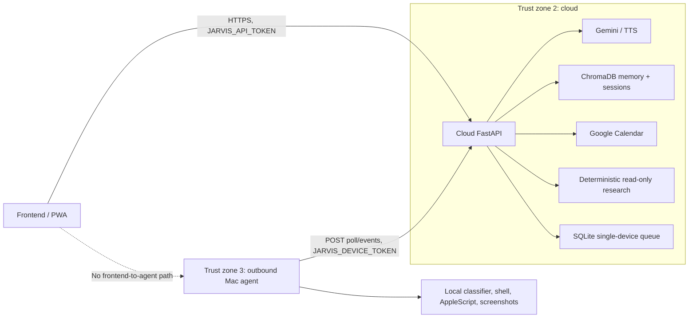

# Gassi-Jarvis system architecture

Gassi-Jarvis has three explicit trust zones. The browser is a client, the
cloud is the orchestration and durable-intent zone, and one configured Mac is
the local capability zone. The browser never connects to the Mac agent.

## Trust zones and data flow



### Frontend zone

`app/static/index.html` and `app/static/app.js` are a vanilla PWA. Runtime
`GET /config.js` supplies an API origin and is deliberately `no-store`. The
browser's single URL helper targets the cloud origin for chat, research,
memory, device status, action status, and decisions. It holds only
`JARVIS_API_TOKEN` in its 12-hour local-storage TTL; it never receives
`JARVIS_DEVICE_TOKEN` and has no agent URL.

### Cloud zone

`app/main.py`, `app/agent.py`, `app/memory.py`, `app/gcal.py`, and
`app/trading/` run in the cloud image. The cloud owns Gemini orchestration,
TTS, ChromaDB memory, disk-persistent sessions, Calendar, and deterministic
financial research. `app/device/cloud.py` stores one configured Mac's action
intent, decisions, heartbeat, leases, terminal result, and optional text
analysis. It does not import or execute `app/device/executor.py`,
`app/security.py`, `app/vision.py`, AppleScript, or launchd. The Docker build
context excludes those local implementations.

The cloud is not a financial source of truth. Deterministic research remains
under `app/trading/` with provenance, freshness, quality, and explicit missing
or unsupported values. ChromaDB, `jarvis_sessions.json`, and LLM history are
not financial state. Gemini may orchestrate or present the structured output,
but cannot calculate authoritative values, recommend trades, or execute
orders. Calendar remains cloud-side; event creation uses its existing separate
HitL flow. A future portfolio module would remain cloud-side, but portfolio
APIs and trading execution are not implemented.

### Mac capability zone

`app/device/agent.py` is an outbound-only client. It opens no listener and
uses the standard-library HTTP client. `app/device/executor.py` is the only
local adapter for the existing shell classifier/executor, allowlisted
AppleScript app activation, and screenshot capture. `app/device/state.py`
stores accepted action payloads, payload hashes, decisions, terminal results,
and replay tombstones in a local SQLite file.

The LaunchAgent wrapper validates a mode-0600 external env file and starts
`python -m app.device.agent` with `KeepAlive`/`RunAtLoad`. It is committed but
not installed or loaded by repository checks.

## Public contracts

The shared Pydantic contracts live in [`app/device/models.py`](app/device/models.py).

| Contract | Important fields | Owner / direction |
|---|---|---|
| `DeviceStatus` | `device_id`, `available`, `status`, `last_seen_at`, reason | Cloud → frontend |
| `DeviceAction` | `action_id`, `device_id`, typed `ActionPayload`, `requires_approval`, creation time | Cloud → agent |
| `ActionPayload` | `action_type` (`open_app`, `shell_command`, `take_screenshot`), raw payload, `tainted` | Cloud → agent; stored unchanged locally |
| `DeviceDecision` | `action_id`, `approved`, optional reason, timestamp | Frontend → cloud → agent |
| `DeviceResult` | action id, terminal status, output/action/error, finished time | Agent → cloud → frontend |
| `DeviceUnavailable` | `available: false`, reason, optional action id | Cloud → frontend |
| `DeviceLifecycle` | action + optional decision/result/unavailable/analysis + status | Cloud → frontend |

The cloud queue has no browser-facing arbitrary-action creation route. Chat and
research orchestration create typed intents internally. Frontend/user routes
use `JARVIS_API_TOKEN`:

```text
GET  /api/device/status
GET  /api/device/actions/{action_id}
POST /api/device/actions/{action_id}/decision
POST /api/chat
POST /api/research/run
GET  /api/memories/recent
GET  /api/research/providers
GET  /api/research/macro
```

Agent routes use `JARVIS_DEVICE_TOKEN` and `X-Jarvis-Device-ID`:

```text
POST /api/device-agent/poll
POST /api/device-agent/actions/{action_id}/events
```

The two bearer credentials are not interchangeable. The configured device ID
must match both the poll body and the optional identity header. This phase is
intentionally single-device; a second Mac requires a future queue/identity
model rather than merely another env file.

## Action lifecycle

```text
cloud online check
  ├─ offline → DeviceUnavailable; no queue entry and no execution
  └─ online → queued
               ↓ agent POST poll (heartbeat + 30 s delivery lease)
             delivered
               ├─ safe local action → running → succeeded/failed/rejected
               └─ local classifier / taint / explicit flag requires HitL
                     ↓ approval_required event
               awaiting_approval (300 s TTL)
                     ├─ action-ID decision approved → approved → running → result
                     ├─ action-ID decision denied → denied → rejected result
                     └─ local/cloud TTL or boot change → expired result
```

The agent polls every two seconds. A successful poll is also the heartbeat;
the cloud reports offline after 10 seconds without one. New work is refused
while offline rather than retained for surprise execution. A delivered cloud
lease lasts 30 seconds and is reclaimed if the agent disappears. Reconnect
backoff is bounded at 30 seconds.

The cloud and local agent both enforce the five-minute approval window. The
agent's monotonic deadline is authoritative for execution and is tied to a
boot/process identity so a restart cannot extend an old approval. The cloud
expires its lifecycle view as well. An approval contains only an action ID:
the agent can execute only the payload it already stored for that ID.

Action IDs and payload hashes make insertion and redelivery idempotent. A
same-ID/different-payload substitution is rejected. The agent records a
terminal result and replay tombstone before reporting it; a report failure can
therefore be retried without running the action twice. Conflicting decisions
or terminal results are rejected.

## Screenshot handling

The Mac capture is bounded to 10 MiB. The agent keeps the bytes in memory and
sends a bounded base64 event. The cloud checks the encoded and decoded limits,
decodes the bytes only for the configured Gemini vision callback, and stores
only returned text analysis in the queue row. Screenshot bytes are never
written to local/cloud SQLite, session JSON, or structured logs. A failed or
oversized capture produces a typed result and no image persistence.

## Cloud as approval relay: explicit limitation

The cloud coordinates the user-facing decision and forwards an action-ID-only
decision. The Mac agent remains authoritative for shell classification and
reclassifies every shell payload locally, but the agent authenticates the
decision only as an authenticated cloud decision; it cannot prove that a
human clicked the frontend. Consequently, a compromised cloud process,
`JARVIS_API_TOKEN` combined with cloud access, or `JARVIS_DEVICE_TOKEN` can
approve a queued dangerous action or enqueue new work. The cloud queue and
tokens are part of the HitL trust base. This design limits payload
substitution and accidental replay, but it does not make a compromised cloud
an untrusted approval source.

## Runtime configuration and origin contract

Cloud values are normally supplied by an external env file. The important
variables are:

| Variable | Contract |
|---|---|
| `GOOGLE_API_KEY` | Cloud Gemini credential. |
| `JARVIS_API_TOKEN` | Frontend/user bearer; unset means localhost-only development behavior. |
| `JARVIS_DEVICE_TOKEN` | Agent-only bearer; separate from the frontend token. |
| `JARVIS_DEVICE_ID` | One configured identity, default `local-mac`. |
| `JARVIS_ALLOWED_ORIGINS` | Browser CORS origins, including a separately hosted static PWA origin. |
| `JARVIS_FRONTEND_API_BASE_URL` | Optional `http://` or `https://` origin only. Empty or `/` path is accepted; credentials, query, fragment, `/api`, and other paths are rejected and fall back to same-origin. |
| `JARVIS_CLOUD_DB_PATH` | Durable cloud queue SQLite path. |
| `JARVIS_BRAIN_DIR` / `JARVIS_SESSIONS_FILE` | ChromaDB and session persistence paths. |
| `JARVIS_CLOUD_API_BASE_URL` | Agent cloud origin; remote HTTPS only, with HTTP allowed for explicit loopback compatibility mode. |
| `JARVIS_DEVICE_AGENT_STATE_PATH` | Local agent SQLite state path. |
| `JARVIS_SHELL_CWD` | Existing absolute local sandbox required by the agent. |
| `JARVIS_LOG_LEVEL` | Cloud logging level. |
| `JARVIS_GCAL_CREDENTIALS` / `JARVIS_GCAL_TOKEN` | Optional cloud Calendar OAuth paths. |
| `JARVIS_AGENT_PROJECT_DIR` / `JARVIS_AGENT_PYTHON` | Launchd wrapper paths. |

`GET /config.js` returns `window.JARVIS_CONFIG = { apiBaseUrl: "..." }` with
`Cache-Control: no-store`. A static host must provide the same origin/root
contract before `app.js` loads; never configure a value ending in `/api`.
`sw.js` leaves `/config.js`, `/api/*`, and every non-GET request on the live
network.

## Operations, incident response, and recovery

Normal operations:

1. Keep the cloud bound to `127.0.0.1` and expose it through Tailscale Serve
   or another private HTTPS tunnel. Tailscale identity/app-capability headers
   are transport context, not either Jarvis bearer.
2. Keep cloud and Mac env files outside Git with mode `0600`. Rotate both
   tokens independently and update the corresponding process.
3. Check `GET /api/device/status` with the frontend token. `online` means a
   recent heartbeat, not proof that a particular action completed; poll
   `GET /api/device/actions/{action_id}` for lifecycle/result.
4. On macOS grant the agent's Python host **Screen Recording** for
   `screencapture` and **Automation** for AppleScript app activation. These
   permissions belong only in the Mac zone.

For a suspected incident, revoke/replace both bearer tokens, stop or unload
the Mac LaunchAgent, and inspect cloud/device logs and SQLite metadata without
copying screenshot bytes. Do not approve pending actions while investigating.
Because terminal results are recorded before reporting, restarting either
process is safe for completed actions: a later poll/event replay converges on
the stored result. Pending approvals from a new Mac boot/process expire
fail-closed. Back up the cloud volumes and the local agent SQLite file before
planned migration; database schema migrations are additive, but lost state
cannot be reconstructed from the frontend.

## Compatibility and migration risks

- The system remains one configured Mac. Adding a second device is not
  supported by the current queue identity model.
- `scripts/run_local_compat.py` preserves a loopback two-process migration
  mode, but it is not a production topology and does not install/load
  launchd.
- Existing `jarvis_sessions.json` can contain legacy pending shell commands.
  The cloud no longer executes a legacy raw command; ask for the action again
  so it becomes a typed device action. Calendar pending entries retain their
  separate cloud approval path.
- A separately hosted PWA must set both its CORS origin and the API origin
  contract. A stale cached `config.js`, an API path instead of an origin, or a
  missing frontend token produces an unavailable/unauthorized client rather
  than a direct Mac fallback.
- The cloud and agent must use compatible action models and device IDs. Keep
  the local state file during agent upgrades so hashes, decisions, terminal
  results, and tombstones survive; an old agent cannot safely be assumed to
  understand newer action types.

## Related implementation references

- [`app/device/models.py`](app/device/models.py) — typed contracts.
- [`app/device/cloud.py`](app/device/cloud.py) — queue, heartbeat, leases,
  expiry, idempotency, and in-memory screenshot analysis.
- [`app/device/agent.py`](app/device/agent.py) — outbound poll loop,
  reclassification, local TTL, and durable result reporting.
- [`app/device/routes.py`](app/device/routes.py) — separated auth surfaces.
- [`docs/deployment.md`](docs/deployment.md) — Compose, Tailscale, static
  host, launchd, and local compatibility runbook.
- [`SECURITY.md`](SECURITY.md) — security controls and residual risks.
