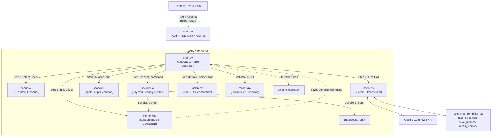

# Gassi-Jarvis System Architecture

The Gassi-Jarvis backend operates on a decoupled, layered architecture. It combines a Voice-First UI with a Layered Security Router that acts as a Large Action Model (LAM) for macOS automation, gated behind bearer-token auth and a Human-in-the-Loop approval flow.

## Microservice Architecture Diagram

---

## File Structure & Responsibilities

| File | Primary Responsibility | Key Components |
|------|------------------------|----------------|
| **`main.py`** | **Gateway & Controller** | Single entry point. Enforces bearer-token auth (`JARVIS_API_TOKEN`), per-IP rate limiting (SlowAPI), and a CORS allowlist. Manages the 4-step request lifecycle (HitL Interceptor → LLM Call → Tool Executor → TTS/Response). |
| **`models.py`** | **API Contract** | Enforces strict JSON validation using Pydantic v2 (`MessagePayload`, `ChatRequest`, `ChatResponse`). |
| **`memory.py`** | **Session & RAG** | Manages ephemeral session state (multi-turn history, pending HitL commands) and persistent long-term memory via ChromaDB vector store. |
| **`agent.py`** | **LLM Orchestrator** | Handles all Google Gemini integrations. Manages multi-turn conversation contexts, executes vision analysis, and acts as an NLP intent classifier. |
| **`security.py`** | **Layered Security Router** | Evaluates shell commands via `evaluate_security_level`. Sandboxes execution via `subprocess.run()` with a configurable working directory. |
| **`vision.py`** | **Vision Module** | Executes macOS `screencapture` against a `tempfile.mkstemp` path (symlink-race safe), drops alpha channels, and compresses images via Pillow. |
| **`logging_config.py`** | **Observability** | Central logging setup; verbosity toggled via `JARVIS_LOG_LEVEL`. Quiets noisy third-party loggers (chromadb, httpx). |

---

## Auth & Transport

`/api/chat` sits behind three composable defenses:

1. **Bearer-token auth** — `JARVIS_API_TOKEN` is compared with `secrets.compare_digest` to avoid timing attacks. If the env var is unset, the endpoint silently downgrades to localhost-only (for safe local dev). The frontend PWA stores the token in `localStorage` with a 12-hour TTL, so a stolen unlocked phone loses access by the next morning.
2. **Rate limiting** — SlowAPI caps `/api/chat` at 20 requests/minute keyed on remote IP. Brute-forcing a 32-character token under that ceiling is computationally infeasible.
3. **CORS allowlist** — `JARVIS_ALLOWED_ORIGINS` (comma-separated) restricts which origins the browser will let read the response. Limits cross-site request forgery from random pages the user happens to visit.

The intended deployment topology is **Mac (local) → tunnel (ngrok or Tailscale, HTTPS) → phone PWA**. The Mac never opens a port to the public internet directly.

---

## Layered Human-in-the-Loop (HitL) Flow

To safely operate as a Large Action Model (LAM) on local macOS hardware, every terminal command generated by Gemini passes through `security.py`.

### Threat Levels
1. **Level 0 (Harmless)**: `echo`, `date`, `whoami` → Executed instantly.
2. **Level 1 (Read-Only)**: `ls`, `pwd`, `cat` → Executed instantly (unless accessing sensitive paths like `.env` or `~/.ssh`).
3. **Level 2 (Dangerous)**: `rm`, `sudo`, `curl`, `pip`, `find -exec`, reads of sensitive paths, or any unknown command → **Intercepted**.

### The Interception Lifecycle
If a Level 2 command is generated:
1. The command is halted and saved to `memory.py` as a `pending_command`.
2. Jarvis responds to the user via TTS: *"Achtung! Der Befehl X ist gefährlich. Soll ich ihn ausführen?"*
3. The next time the user speaks, `main.py` intercepts the audio.
4. `agent.py` uses Gemini (Temperature 0.0) as an NLP intent classifier to evaluate if the user said `APPROVE` ("Ja", "Mach das") or `DENY` ("Stopp", "Nein").
5. **Fail-Closed Gate:** If approved, `security.py` executes the command with `force=True`. If denied, or if the intent is ambiguous (UNCLEAR), the command is safely dropped.

---

## Kill-Switch (Interruptibility)

To ensure the AI is fully controllable and not locked in long operations or TTS playback, a frontend Kill-Switch is implemented:
- **AbortController:** Every fetch request to `/api/chat` is bound to an `AbortController`. If the user interrupts, the pending HTTP request is instantly aborted.
- **Audio Interruption:** If Jarvis is currently speaking (TTS playback), clicking the microphone instantly pauses the audio, resets the time, and triggers the microphone for new input.
- **UI State Management:** Visual feedback (Amber pulsing) is provided when Jarvis is speaking, making it clear that he can be interrupted.
