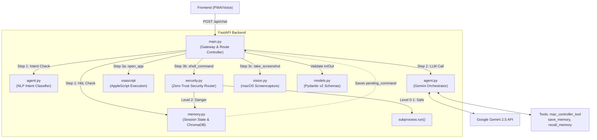

# Gassi-Jarvis System Architecture

The Gassi-Jarvis backend operates on a decoupled, 5-layer microservice architecture. It combines a Voice-First UI with a robust Zero-Trust Security Router that acts as a Large Action Model (LAM) for macOS automation.

## Microservice Architecture Diagram

---

## File Structure & Responsibilities

| File | Primary Responsibility | Key Components |
|------|------------------------|----------------|
| **`main.py`** | **Gateway & Controller** | Single entry point. Manages the 4-step request lifecycle (HitL Interceptor → LLM Call → Tool Executor → TTS/Response). Delegates all logic to other modules. |
| **`models.py`** | **API Contract** | Enforces strict JSON validation using Pydantic v2 (`MessagePayload`, `ChatRequest`). |
| **`memory.py`** | **Session & RAG** | Manages ephemeral session state (history, pending HitL commands) and persistent long-term memory via ChromaDB vector store. |
| **`agent.py`** | **LLM Orchestrator** | Handles all Google Gemini integrations. Declares tools (`mac_controller_tool`), generates responses, and acts as an NLP intent classifier (APPROVE/DENY/UNCLEAR). |
| **`security.py`** | **Zero-Trust Router** | Evaluates shell commands via `evaluate_security_level`. Sandboxes execution via `subprocess.run()`. |
| **`notion_service.py`**| **Knowledge Base** | Direct integration with the Notion API to save formal protocols and search old notes. |
| **`vision.py`** | **Vision Module** | Executes macOS `screencapture`, drops alpha channels, and compresses images via Pillow for API latency reduction. |

---

## Zero-Trust Human-in-the-Loop (HitL) Flow

To safely operate as a Large Action Model (LAM) on local macOS hardware, every terminal command generated by Gemini passes through `security.py`.

### Threat Levels
1. **Level 0 (Harmless)**: `echo`, `date`, `whoami` → Executed instantly.
2. **Level 1 (Read-Only)**: `ls`, `pwd`, `cat` → Executed instantly.
3. **Level 2 (Dangerous)**: `rm`, `sudo`, `curl`, `pip`, or any unknown command → **Intercepted**.

### The Interception Lifecycle
If a Level 2 command is generated:
1. The command is halted and saved to `memory.py` as a `pending_command`.
2. Jarvis responds to the user via TTS: *"Achtung! Der Befehl X ist gefährlich. Soll ich ihn ausführen?"*
3. The next time the user speaks, `main.py` intercepts the audio.
4. `agent.py` uses Gemini (Temperature 0.0) as an NLP intent classifier to evaluate if the user said `APPROVE` ("Ja", "Mach das") or `DENY` ("Stopp", "Nein").
5. If approved, `security.py` executes the command with `force=True`. If denied, it is dropped.
